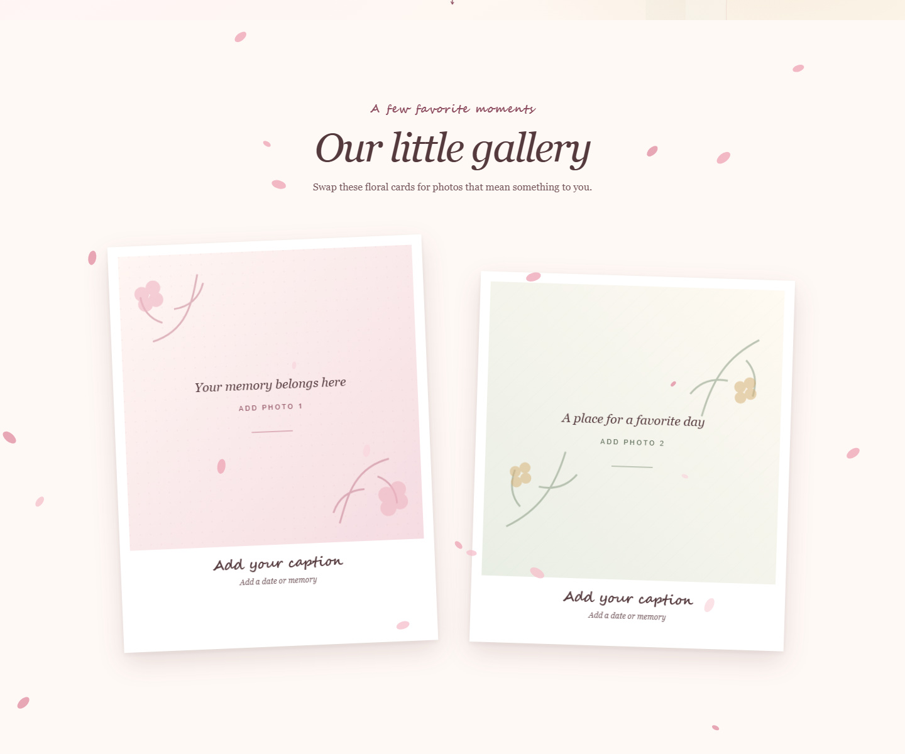

# Birthday Love Letter Template

A warm, floral one-page website for turning a birthday greeting, favorite photographs, and a personal letter into a small digital keepsake.

[View the live demo](https://tomita-ichiro.github.io/birthday-love-letter-template/)



## Overview

The template is ready to use as a static website and intentionally begins with unmistakably generic copy and original illustrated photo placeholders. All personal content lives in one configuration file, while presentation and behavior remain separate. It has no backend, build step, analytics, cookies, forms, or third-party requests.

The reusable template and its original visual design were created by Ichiro Tomita.

## Features

- Full-screen floral birthday greeting
- Lightweight canvas petals with a fixed particle limit
- Responsive polaroid-style gallery with graceful image fallbacks
- Scroll-reveal effects and an animated letter presentation
- Typewriter letter effect and celebratory confetti
- Optional, user-initiated background music control
- Keyboard-visible focus, semantic landmarks, and a skip link
- Complete reduced-motion and JavaScript-disabled fallbacks
- Dependency-free verification and GitHub Pages deployment

## Technologies

Plain HTML, CSS, and JavaScript are used throughout. The verification script uses only Node.js built-in modules. System font stacks and original SVG placeholders avoid runtime dependencies and external asset requests.

## Project structure

```text
birthday-love-letter-template/
├── .github/
│   └── workflows/
│       └── deploy-pages.yml
├── docs/
│   └── screenshot.png
├── site/
│   ├── .nojekyll
│   ├── index.html
│   ├── assets/
│   │   └── placeholders/
│   │       ├── favicon.svg
│   │       ├── photo-1.svg
│   │       ├── photo-2.svg
│   │       ├── photo-3.svg
│   │       └── photo-4.svg
│   ├── css/
│   │   └── styles.css
│   └── js/
│       ├── content.js
│       └── main.js
├── scripts/
│   └── verify.mjs
├── .gitignore
├── LICENSE
└── README.md
```

Only `site/` is published by the Pages workflow.

## Quick customization

1. Open `site/js/content.js`.
2. Replace the demonstration occasion, recipient, headings, letter, signature, and footer values.
3. Add your own optimized images under `site/assets/photos/` and update each photo's `src`, `alt`, `caption`, and `date`.
4. Optionally add audio you have permission to publish under `site/assets/audio/` and configure `music.file`.
5. Run `node scripts/verify.mjs`, then preview the site locally.

Configuration strings are rendered with safe DOM text APIs. Markup placed inside a string is displayed as text rather than executed as HTML.

## Content configuration

`site/js/content.js` exposes one `window.SITE_CONTENT` object:

| Property | Purpose |
| --- | --- |
| `pageTitle`, `description` | Browser title, search description, and matching social metadata |
| `occasion`, `recipientName` | Main hero heading |
| `heroEyebrow`, `heroSubtitle` | Supporting hero copy |
| `galleryEyebrow`, `galleryHeading` | Gallery section headings |
| `photos` | Image path, meaningful alternative text, caption, and date for each card |
| `letterDate`, `salutation` | Letter heading details |
| `letterParagraphs` | Any number of letter paragraphs, in reading order |
| `signature`, `footerText` | Letter closing and footer copy |
| `petals`, `confetti` | Enable switches, bounded counts, and color palettes |
| `music.file`, `music.title` | Optional local audio path and displayed title |

Long names, captions, and paragraph lists wrap naturally. Keep alternative text concise while describing what matters in the photograph; do not repeat the caption unless it conveys the same information.

## Replacing photo placeholders

Create `site/assets/photos/` and place web-ready images there. Use lowercase, web-safe filenames such as `sunset-picnic.webp`. Supported formats are JPEG, PNG, WebP, AVIF, and GIF. Then update a photo entry:

```js
{
  src: "assets/photos/sunset-picnic.webp",
  alt: "Two people sharing a picnic at sunset",
  caption: "Add your caption",
  date: "Add a date or memory"
}
```

The gallery reserves square image dimensions to prevent layout shift, uses lazy loading, and applies `object-fit: cover`. A missing or failed image returns to the matching floral placeholder.

Before publishing, resize oversized photos to the largest dimensions actually needed—roughly 1600 pixels on the longest edge is ample for this layout. Exporting as WebP or a well-compressed JPEG usually keeps the page light.

Important: remove EXIF, GPS, camera, device, and thumbnail metadata from every image. Many image editors offer a “remove metadata” or “export for web” option. Check the exported file with a metadata inspector before committing it. Only publish photos with the permission of everyone shown.

## Optional licensed music

Music is off and completely hidden by default. With an empty `music.file`, the page creates no audio request. To enable it:

1. Create `site/assets/audio/`.
2. Add an audio file you created or are licensed to redistribute. Supported extensions are OGG, WAV, WebM, M4A, and AAC.
3. Set `music.file` and `music.title` in `site/js/content.js`.

Playback begins only when the visitor presses the play button. The control reports its play/pause state to assistive technology and handles rejected playback without an uncaught error.

You must have permission to publish and redistribute any audio you add. Do not upload commercial recordings merely because you purchased or streamed them. Linking visitors to the artist's official streaming page is often the safer alternative.

## Local preview

From the repository root, run:

```text
python -m http.server 8000 --directory site
```

Then open `http://localhost:8000/`. Python is only a convenient static server and is not an application dependency. Any static file server can be used instead.

Run the repository checks with:

```text
node scripts/verify.mjs
```

The verifier checks the exact publishable allowlist, local references, lowercase asset naming, media limits, configuration paths, and common privacy or deployment leaks.

## GitHub Pages deployment

The workflow in `.github/workflows/deploy-pages.yml` runs on pushes to `main` and can also be started manually. It verifies the project, configures Pages, uploads only `site/`, and deploys the resulting artifact using narrowly scoped permissions.

After creating a GitHub repository and pushing `main`, open **Settings → Pages** and choose **GitHub Actions** as the source if it is not selected automatically. This template is live at:

```text
https://tomita-ichiro.github.io/birthday-love-letter-template/
```

All site paths are relative, so the project works beneath this repository subpath.

## Accessibility and motion

The page uses semantic header, main, section, article, and footer elements; a logical heading order; an early skip link; real buttons; explicit audio state; descriptive image text; and strong visible focus styling. Decorative canvas and symbols are hidden from assistive technology. Gallery cards are intentionally non-interactive.

When `prefers-reduced-motion: reduce` is active, petals, confetti, bouncing, heartbeat, scroll reveals, letter entrance, and typewriter motion stop. Content is shown immediately. Without JavaScript, the full generic letter and gallery remain readable.

Animation stops when the tab is hidden, canvas resolution is capped, resize work is scheduled once per frame, and particle arrays are bounded.

## Browser support

Current versions of Chrome, Edge, Firefox, and Safari are supported, along with their mobile equivalents. The core content remains readable if canvas animation or intersection observation is unavailable. Very old browsers may not receive the decorative effects.

## Known limitations

- This is a static template; it does not include an editor, uploads, forms, or a backend.
- Gallery images are cropped to a square. Change `aspect-ratio` or `object-fit` in `styles.css` for another presentation.
- Social platforms may cache an older title or description after content changes.
- Audio format support varies slightly by browser; OGG and M4A provide broad complementary coverage, but the template accepts one configured source.

## Attribution and ownership

The reusable template code, original placeholder illustrations, and visual design are copyright © 2026 Ichiro Tomita. No ownership is claimed over browser/system fonts, emoji glyph designs supplied by a visitor's operating system, or media added by users. The repository ships no third-party photographs, font files, libraries, or recordings.

## License

Released under the [MIT License](LICENSE). Reuse and modification are welcome, provided the copyright and license notice remain with copies or substantial portions of the software.
